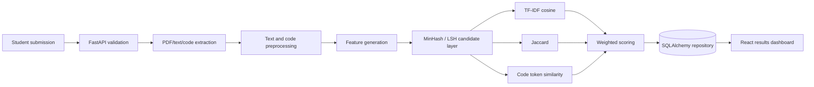

# Project Similarity Detection System

An explainable academic decision-support platform that compares a new student project with a historical repository using textual, token-based, approximate, and source-code similarity. It retrieves related work and exposes evidence; it does **not** automatically declare plagiarism.

## Problem statement and objectives

Manual comparison becomes inconsistent as project archives grow. This MVP gives faculty a searchable repository, safe file intake, real multi-signal ranking, component scores, and a printable review report. Its goals are reproducibility, understandable algorithms, safe handling, and a clear path from submission to evidence.

## Architecture



The React/Vite client calls typed FastAPI endpoints. SQLAlchemy targets PostgreSQL through `DATABASE_URL` and defaults to SQLite for a zero-configuration demonstration. The service creates tables and seeds ten meaningful projects on first startup.

## Similarity workflow

1. **Validate:** required metadata, upload extension, non-empty content, parseability, and size limits (10 MB reports; 5 MB sources).
2. **Extract:** read TXT/PDF reports and supported code files or safe ZIP members. Uploaded code is never run.
3. **Preprocess:** lowercase/tokenize text, remove punctuation and stopwords; strip code comments and normalize identifiers.
4. **Retrieve:** create deterministic 64-value MinHash signatures over token trigrams. The direct comparison fallback is appropriate for the seeded repository; signatures form the basis for LSH buckets as the archive grows.
5. **Compare:** calculate independent title, abstract/description, report, keyword, MinHash, and code scores.
6. **Aggregate:** apply title 10%, abstract 25%, report 20%, keywords 15%, MinHash 10%, and code 20%. If report/code is unavailable on either side, its weight is redistributed across available evidence.
7. **Explain:** rank up to ten matches and persist the overall score, classification, component scores, shared concepts, and reasons.

### Evaluator-friendly algorithm guide

- **TF-IDF** gives more weight to discriminative terms than common vocabulary. **Cosine similarity** measures the angle between two TF-IDF vectors (0 to 1), making it useful for differently sized abstracts and reports.
- **Jaccard similarity** is `|A ∩ B| / |A ∪ B|`; the system applies it to normalized keyword/token sets and displays their intersection.
- **MinHash** repeatedly records the minimum deterministic hash of the documents' shingles. The share of equal signature positions approximates Jaccard overlap without retaining every pairwise set comparison.
- **LSH** groups compatible sections of MinHash signatures into buckets, allowing a large archive to retrieve likely matches before expensive comparisons. The MVP documents this candidate layer while using an honest direct fallback for its small seed collection.
- **Code token similarity** strips comments, preserves operators/control-flow words, maps incidental identifiers to `ID`, and combines token cosine and Jaccard. It is a practical structural signal, not a claim to reproduce JPlag or full AST analysis.

Scores map to Low (0–24%), Moderate (25–49%), Significant (50–69%), High (70–84%), and Very High (85–100%) Similarity. Labels are review aids, never misconduct findings.

## Technology stack

- React 19, Vite, plain responsive CSS, Motion, GSAP, OGL
- FastAPI, Pydantic, Uvicorn
- scikit-learn and NumPy
- SQLAlchemy with PostgreSQL support and SQLite fallback
- pytest

## Run locally

Prerequisites: Node 20+, Python 3.11+, and optionally PostgreSQL.

```bash
cp .env.example .env
python -m venv .venv
source .venv/bin/activate
pip install -r backend/requirements.txt
cd backend && uvicorn app.main:app --reload
```

In a second terminal:

```bash
cd frontend
npm install
npm run dev
```

Open `http://localhost:5173`. API documentation is at `http://localhost:8000/docs`. For PostgreSQL, install a compatible driver (for example `psycopg[binary]`) and set the `DATABASE_URL` shown in `.env.example`; otherwise SQLite creates `backend/similarity.db`.

## Demo scenario

Submit **Academic Project Similarity Checker** with an abstract mentioning project reports, TF-IDF, cosine similarity, MinHash, repository retrieval, and normalized source-code tokens. It should rank **Project Similarity Detection** first and **Code Plagiarism Detector** as a secondary code-oriented match. Scores are computed at request time, not hardcoded.

## API overview

| Method | Route | Purpose |
|---|---|---|
| GET | `/api/health` | Readiness check |
| GET/POST | `/api/projects` | Search/list or add a project |
| GET/DELETE | `/api/projects/{id}` | Read or remove a project |
| POST | `/api/analysis` | Multipart validation and analysis |
| GET | `/api/analysis/{id}` | Persisted analysis with ranked evidence |
| GET | `/api/analysis/{id}/results` | Results alias |
| GET | `/api/algorithms` | Algorithm catalogue |

## Repository structure

```text
backend/app/          FastAPI, SQLAlchemy entities, seed data
backend/app/similarity/ Multi-signal similarity engine
backend/tests/        Algorithm tests
frontend/src/         Pages, API client, styles and reusable visual components
```

## Security and limitations

Uploads are memory-limited, extension checked, read as data, and never executed. ZIP intake accepts only supported code extensions, caps individual members, and ignores directory entries. Production deployments should add authentication, rate limiting, malware scanning, object storage, database migrations, audit logging, and reverse-proxy body limits.

Lexical methods can miss paraphrases, and identifier normalization is intentionally language-agnostic rather than AST-aware. MinHash/LSH is most valuable for a substantially larger archive. Similarity can arise legitimately from a shared domain or required terminology, so faculty review remains essential.

## Future improvements

Sentence embeddings, AST-based code comparison, persisted LSH indexes, faculty/student roles, semester repositories, cloud object storage, configurable institutional scoring profiles, review workflows, and generated PDF exports can fit behind the current service boundaries.
